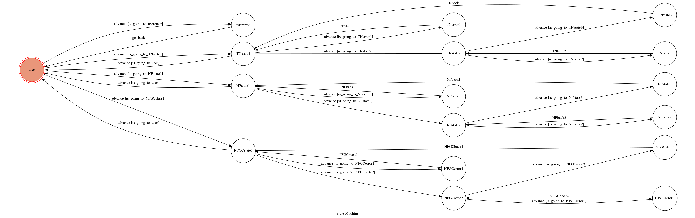

# TOC Project 2017

Final Code for TOC Project 2017 from F74036475 尹紹宇

A telegram bot based on a finite state machine

## Setup

### Prerequisite
* Python 3

#### Install Dependency
```sh
pip3 install -r requirements.txt
```

* pygraphviz (For visualizing Finite State Machine)
    * [Setup pygraphviz on Ubuntu](http://www.jianshu.com/p/a3da7ecc5303)
### Run Locally

**`ngrok` would be used in the following instruction**

```sh
./ngrok http 5000
```

After that, `ngrok` would generate a https URL.

should set `WEBHOOK_URL` (in app.py) to `generating-https-URL/hook`.因為每次ngrok給的網址不同,須請助教幫忙改code

若要使用助教的bot(我的bot name: @CrazyNightBot),須請助教將`API_TOKEN`(in app.py)換成助教的

#### Run the sever

```sh
python3 app.py
```

## Finite State Machine

或是generating-https-URL/show-fsm也可以看到

## Usage

輸入字串都會trigger`advance`

第一個state是`user`
* 輸入任意字串(TN, NF, NFGC之外)會先進到`usererror`再`go_back`回`user`,這時會收到reply(反覆輸入錯誤的也會重複顯示):

	>請輸入代號以選擇台南影城:

	>TN=>台南大遠百威秀

	>NF=>台南南紡威秀

	>NFGC=>台南南紡威秀(gold class)

* 輸入影城代號會進到各自的`state1`,收到reply:

	>請輸入search 搜尋-----威秀院線電影

	>或輸入back 重新選擇台南影城

在`state1`中
* 若輸入search會進到`state2`,然後parse威秀時刻表網站並reply上映的電影及編號
* 若輸入back會回到`user`
* 若輸入上述兩者以外會進`error1`(reply:錯誤輸入)然後`back1`回`state1`

在`state2`中
* 若輸入上映的電影編號,會進到`state3`,然後parse網站得到詳細的時刻表並reply,最後`back1`回`state1`
* 若輸入的非編號或編號超過上映的電影,會進`error2`(reply:錯誤輸入)然後`back2`回`state2`

## Feature

* parse網站
* 錯誤處理
* 盡量讓使用者的每個輸入都能得到回應

## Author
[尹紹宇](https://github.com/45151431)
